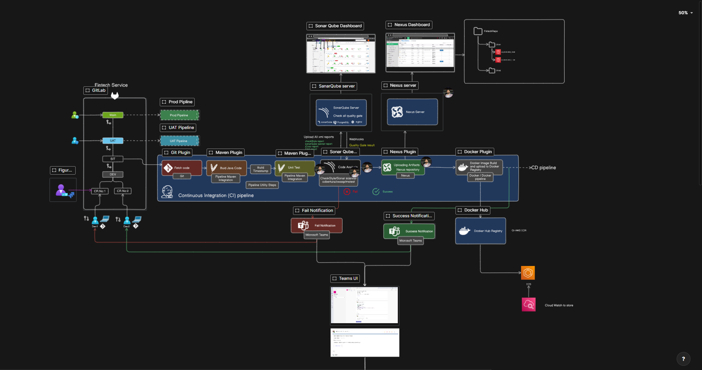

# Automated CI/CD Platform – Project Overview

This project implements a complete DevOps CI/CD pipeline for Java applications, leveraging a multi-VM infrastructure provisioned with Vagrant and VirtualBox. The solution integrates Jenkins, Nexus, SonarQube, Docker, Ansible, and Nginx, with automated notifications to Microsoft Teams.

---

## Architecture & Flow

- **Source Control:** Code is managed in GitHub (can be adapted for GitLab).
- **CI Pipeline:** Jenkins automates code checkout, Maven build/test, SonarQube code analysis, artifact publishing to Nexus, Docker image build/push, and deployment via Ansible.
- **Artifact Management:** Nexus serves as both Maven and Docker registry.
- **Quality Gates:** SonarQube enforces code quality before deployment.
- **CD Pipeline:** Ansible pulls Docker images from Nexus and deploys to SIT servers.
- **Load Balancing:** Nginx provides high availability for deployed services.
- **Notifications:** Microsoft Teams receives build and deployment status updates.

---

## Project Flow Diagram

> **For an interactive view, see:**  
> [Eraser Flow Diagram](https://app.eraser.io/workspace/4vLO3v6AN8hzQgnnBomT?origin=share)

---

## Key Components

- **Jenkins:** Orchestrates the CI/CD pipeline.
- **Nexus:** Stores Maven artifacts and Docker images.
- **SonarQube:** Performs static code analysis and enforces quality gates.
- **Docker:** Containerizes the application for consistent deployment.
- **Ansible:** Automates deployment to SIT servers.
- **Nginx:** Acts as a load balancer for high availability.
- **Microsoft Teams:** Receives notifications for build and deployment events.
- **Vagrant & VirtualBox:** Provision and manage the multi-VM environment.

---

## How It Works

1. **Code Commit:** Developers push code to the repository.
2. **CI Trigger:** Jenkins fetches code, builds with Maven, runs tests, and performs code analysis with SonarQube.
3. **Artifact Publishing:** Build artifacts are uploaded to Nexus.
4. **Dockerization:** Jenkins builds a Docker image and pushes it to Nexus Docker registry.
5. **Deployment:** Ansible pulls the Docker image from Nexus and deploys it to SIT servers.
6. **Load Balancing:** Nginx routes traffic to the running containers.
7. **Notifications:** Teams channel receives real-time status updates.

---

## Getting Started

1. Clone this repository.
2. Use Vagrant to provision the infrastructure (`vagrant up` in the `multi-vm-ci-cd` directory).
3. Configure Jenkins, Nexus, and SonarQube as per your environment.
4. Update Ansible inventory and credentials.
5. Trigger the Jenkins pipeline to start the CI/CD process.

---

## References

- [Eraser Flow Diagram](https://app.eraser.io/workspace/4vLO3v6AN8hzQgnnBomT?origin=share)

---

